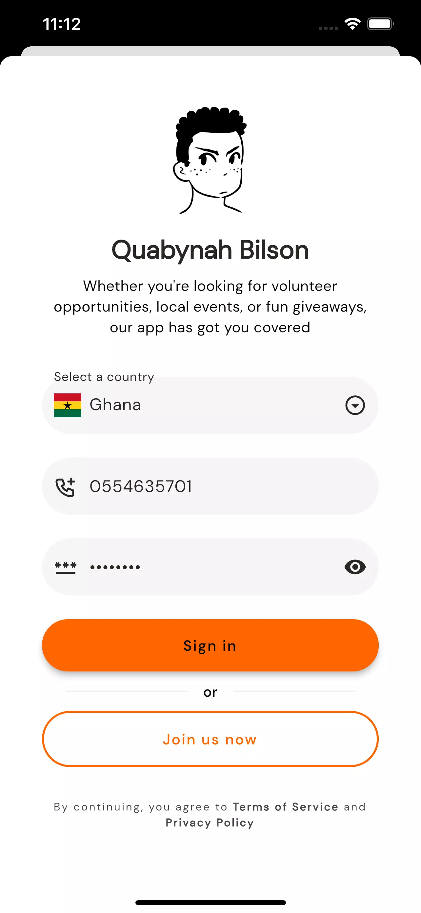
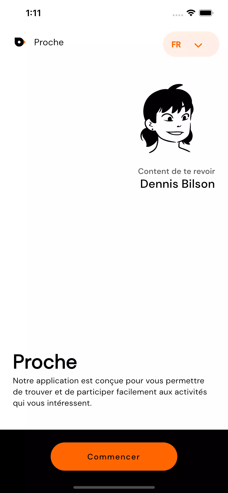
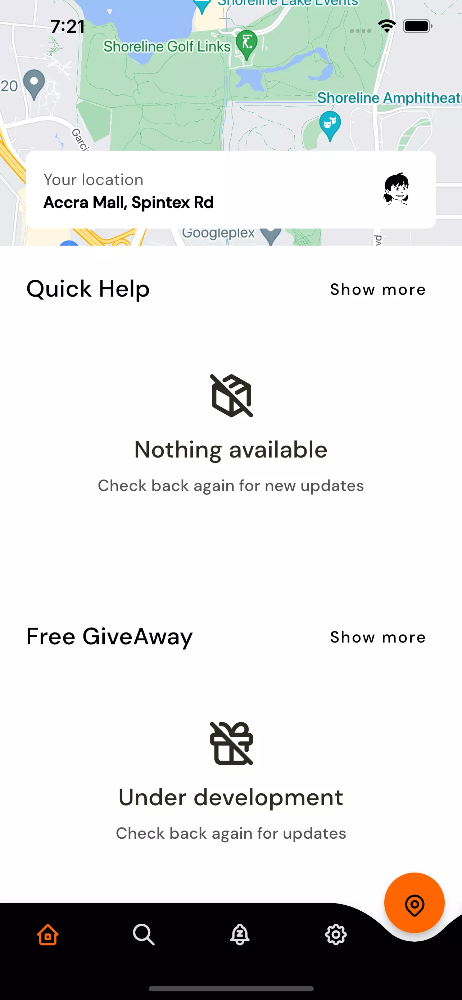

[](https://flutter.dev)
[](https://www.behance.net/gallery/137262233/Google-Nearme-Case-Study)

Welcome to Proche, the app that helps you to look for volunteer opportunities, local events, or fun giveaways in your
local area.
This Flutter application is designed to make it easy for users to search for and participate in activities that interest
them,
all from the convenience of their mobile device.


[//]: # (https://dribbble.com/shots/16905482-Bird-Eye-View-aerial-photography-logo-design-pin-pointer-bird)

### Features

- `Task Finder`: Easily find volunteer opportunities and other tasks in your area that match your interests and
  availability.

- `Event Locator`: Discover local events, concerts, festivals, and more, with detailed information on dates, times, and
  locations.

- `Giveaway Tracker`: Stay up-to-date on the latest giveaways, contests, and promotions happening in your community.

- `Customizable Filters`: Tailor your search results to your preferences by filtering by category, date, location, and
  more.

### Screenshots

<div align="center">





</div>

[//]: # ()

### Getting Started

To run this app on your device, follow these steps:

- Clone this repository to your local machine using git clone https://github.com/your-username/proche.git.

- Install the necessary dependencies by running flutter pub get.

- Setup your environment variables with file `.env` like this:
  ```.env
  # microservices
  AUTH_SERVER_URL=0.0.0.0
  AUTH_SERVER_PORT=1800
  SHARED_SERVER_URL=0.0.0.0
  SHARED_SERVER_PORT=1900
  CORE_SERVER_URL=0.0.0.0
  CORE_SERVER_PORT=2000
  ```
    - For Google Maps configuration, setup iOS like this:
        - Create a property list file called `secrets.plist` in the `ios/Runner` directory.
      ```xml
          <?xml version="1.0" encoding="UTF-8"?>
          <!DOCTYPE plist PUBLIC "-//Apple//DTD PLIST 1.0//EN" "http://www.apple.com/DTDs/PropertyList-1.0.dtd">
          <plist version="1.0">
            <dict>
                  <key>googleMapsApiKey</key>
                  <string>YOUR GOOGLE_MAPS_KEY</string>
            </dict>
          </plist>
        ```
        - Update your `AppDelegate.swift` file like this:
          ```swift
            import UIKit
            import Flutter
            import GoogleMaps
      
            @UIApplicationMain
            @objc class AppDelegate: FlutterAppDelegate {
            override func application(
              _ application: UIApplication,
              didFinishLaunchingWithOptions launchOptions: [UIApplication.LaunchOptionsKey: Any]?
            ) -> Bool {
              if let path = Bundle.main.path(forResource: "secrets", ofType: "plist") {
                  let plist = NSDictionary(contentsOfFile: path)
                  let apiKey = plist?.value(forKey: "googleMapsApiKey") as? String
                  // Use the apiKey value as needed
                  GMSServices.provideAPIKey(apiKey ?? "provide_google_auth_key")
                }
      
               GeneratedPluginRegistrant.register(with: self)
               return super.application(application, didFinishLaunchingWithOptions: launchOptions)
              }
            }
          ```
            - On Android, we also need to make a few adjustments:
                - Create a `key.properties` file in the `mobile/android` directory.
                    - Add the following line to the file:
                      ```properties
                        googleMapsKey=<YOUR_GOOGLE_MAPS_KEY>
                       ```
                        - Update your `app/build.gradle` file like this:
                       ```groovy
                          android {
                          compileSdkVersion 33
                          defaultConfig {
                              applicationId "com.qcodelabsllc.proche.mobile"
                              minSdkVersion 23
                              targetSdkVersion flutter.targetSdkVersion
                              versionCode flutterVersionCode.toInteger()
                              versionName flutterVersionName
                    
                              // add this line
                              buildConfigField("String", "MAPS_API_KEY", "\"${keystoreProperties['googleMapsKey']}\"")
                      
                              // add this line
                              manifestPlaceholders = [
                                    googleMapsKey: "\"${keystoreProperties['googleMapsKey']}\"",
                                    launcherName: "Proche",
                              ]
                          }
                             buildTypes {
                                    release {
                                    signingConfig signingConfigs.debug
                                }
                             }
                          }
                         ```
                        - Finally, update your `AndroidManifest.xml` with this snippet within your application tag:
                          ```xml
                          <application
                              android:name="io.flutter.embedding.android.FlutterActivity"
                              android:icon="@mipmap/launcher_icon"
                              android:label="${launcherName}"
                              tools:ignore="Instantiatable">
                                <!-- add this line -->
                              <meta-data
                              android:name="com.google.android.geo.API_KEY"
                              android:value="${googleMapsKey}" />
                                <!-- rest of code goes here -->
                          <application/>
                          ```

- Connect your device to your computer and run the app using flutter run.

- Start discovering new tasks, events, and giveaways in your area!

### Technologies Used

- `Flutter`: A cross-platform framework for building high-performance, high-fidelity mobile apps for iOS and Android.

- `Firebase Messaging`: A cloud messaging platform that allows developers to send notifications and messages to users
  across multiple platforms, including Android, iOS, and web. It provides a simple and reliable way to deliver messages
  and engage with users in real-time. With Firebase Messaging, developers can send targeted messages to specific users
  or groups, track message delivery and engagement, and customize the look and feel of notifications.

- `Google Maps API`: A set of tools and services for building interactive, location-based applications.
- `gRPC`: A high-performance, open-source framework for building distributed systems and microservices.

- `Get_It`: A simple, lightweight service locator for Flutter that provides a convenient way to access objects from
  anywhere in your application.

- `Injectable`: A powerful dependency injection framework for Flutter that simplifies the management of complex object
  graphs and reduces boilerplate code.

- `Lottie`: A library for Android, iOS, and React Native that renders After Effects animations in real-time. Lottie
  makes it easy to add high-quality animations to your Flutter app, without the need for complex animations code.

### Flutter Clean Architecture

`Flutter Clean Architecture` is a software design pattern that provides a way to structure code in a modular, reusable,
and maintainable way. It is based on the principles of Separation of Concerns and Dependency Injection. By separating
the concerns of the application into layers, it helps developers to write testable, scalable, and maintainable code.

#### Layers of Flutter Clean Architecture

Flutter Clean Architecture has four main layers:

- `Presentation Layer`: This layer contains UI-related code and is responsible for rendering the views. It communicates
  with
  the business logic layer through an interface (or contract) that defines what data the UI needs and what actions the
  user can perform. In Flutter, this layer can be implemented using Widgets.

- `Business Logic Layer`: This layer contains the core of the application's business logic. It communicates with the
  data
  layer through an interface (or contract) that defines what data it needs and what operations it can perform. This
  layer
  is independent of the UI layer and can be easily tested. In Flutter, this layer can be implemented using BLoCs,
  Cubits,
  or plain Dart classes.

- `Data Layer`: This layer contains code that interacts with external data sources such as APIs or databases. It
  implements
  the contracts defined in the business logic layer and provides the required data to the business logic layer. In
  Flutter, this layer can be implemented using Repositories, DataSources, or plain Dart classes.

- `Domain Layer`: This layer contains the domain models and business rules of the application. It is independent of any
  specific technology or framework and defines the entities, value objects, and aggregates of the application.

##### Relevant Links

- The Clean Architecture by Uncle Bob (Robert C. Martin)
- Flutter Clean Architecture with Provider and BLoC by Reso Coder
- Flutter TDD Clean Architecture Course by Paulo Dichone
- Clean Architecture with Flutter and GraphQL by Radoslav Vitanov
- Clean Architecture with Flutter and Redux by Piyush Khandelwal
  These resources can help you get started with Flutter Clean Architecture and provide a solid foundation for building
  scalable and maintainable applications.

### Contributing

We welcome contributions from the community! If you encounter any bugs, issues, or feature requests, please open an
issue on our GitHub repository. If you would like to contribute code, please fork the repository and submit a pull
request.

### License

This app is released under the MIT License. See LICENSE for details.

Thank you for using Proche! We hope you enjoy using our app to discover new tasks, events, and giveaways in your
area.

